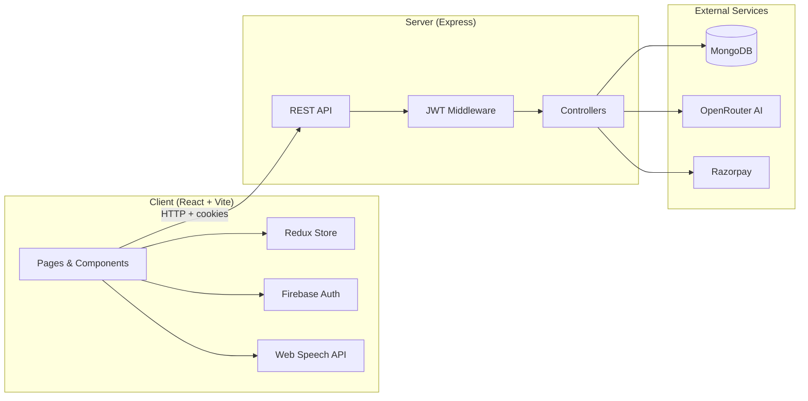

# Interview AI

An AI-powered mock interview platform that helps candidates practice job interviews with personalized questions, voice-based sessions, real-time feedback, and detailed performance reports.

## Features

### Authentication & User Management
- **Google Sign-In** via Firebase Authentication
- **JWT session cookies** for secure, persistent login
- **Credit balance** tracked per user (100 free credits on signup)

### Resume Intelligence
- Upload a **PDF resume** (up to 5 MB)
- AI extracts structured data: role, experience, projects, and skills
- Extracted fields auto-fill the interview setup form

### AI Interview Engine
- **Three interview modes:** Technical, HR, and Behavioral
- Generates **5 tailored questions** per session based on role, experience, resume, projects, and skills
- Progressive difficulty: easy → medium → hard
- Per-question **time limits** (60s, 60s, 90s, 90s, 120s)
- Costs **50 credits** per interview session

### Voice-Based Interview Experience
- **Text-to-speech** AI interviewer with male/female voice options and animated avatar videos
- **Speech recognition** for hands-free answer capture via the browser microphone
- Timed questions with countdown timer
- Retry questions and view **AI-generated suggested answers**

### AI Evaluation & Feedback
- Each answer scored on three dimensions (0–10):
  - **Confidence** — clarity and presentation
  - **Communication** — language and structure
  - **Correctness** — accuracy and relevance
- Short, human-like feedback after every answer
- **Suggested answers** for study and improvement

### Reports & History
- **Interview history** with status tracking (Incompleted / Completed)
- **Resume incomplete interviews** from where you left off
- **Detailed performance reports** with:
  - Overall score and skill breakdowns
  - Per-question score chart (Recharts)
  - Circular progress indicators
  - **PDF export** (jsPDF)
- Delete past interviews

### Payments
- **Razorpay** integration for purchasing credit packs (INR)
- Plans: Starter Pack (₹199 / 150 credits), Pro Pack (₹499 / 600 credits)
- Server-side payment signature verification

---

## Architecture

The project is a **monorepo** with a React frontend and an Express API backend.

```
interview-ai/
├── client/          # React + Vite frontend
└── server/          # Express + MongoDB backend
```

### High-Level Flow



### Tech Stack

| Layer | Technologies |
|-------|-------------|
| **Frontend** | React 19, Vite, Tailwind CSS 4, Redux Toolkit, React Router, Motion, Recharts, jsPDF |
| **Backend** | Node.js, Express 5, Mongoose, Multer, pdfjs-dist |
| **Database** | MongoDB |
| **AI** | OpenRouter API (`openai/gpt-4o-mini`) |
| **Auth** | Firebase (Google OAuth) + JWT cookies |
| **Payments** | Razorpay |

### Frontend Structure

| Path | Purpose |
|------|---------|
| `client/src/pages/` | Route-level pages (Home, Auth, Interview, History, Report, Pricing) |
| `client/src/components/` | UI components (3-step interview flow, Navbar, modals) |
| `client/src/redux/` | Global user state |
| `client/src/utils/firebase.js` | Firebase initialization |

**Interview flow (3 steps):**
1. **Step1Setup** — Configure role, experience, mode; optional resume upload
2. **Step2Interview** — Voice interview with AI avatar, timer, and live scoring
3. **Step3Report** — Performance summary, charts, and PDF download

### Backend Structure

| Path | Purpose |
|------|---------|
| `server/index.js` | Express app entry point, CORS, route mounting |
| `server/routes/` | API route definitions |
| `server/controllers/` | Request handlers (auth, interview, payment, user) |
| `server/models/` | Mongoose schemas (User, Interview, Payment) |
| `server/services/` | OpenRouter AI and Razorpay clients |
| `server/middlewares/` | JWT auth (`isAuth`) and file upload (`multer`) |

### API Endpoints

| Method | Endpoint | Description |
|--------|----------|-------------|
| `POST` | `/api/auth/google` | Google OAuth login, sets JWT cookie |
| `GET` | `/api/auth/logout` | Clear session cookie |
| `GET` | `/api/user/current` | Get authenticated user |
| `POST` | `/api/interview/resume` | Upload & analyze PDF resume |
| `POST` | `/api/interview/generate-questions` | Generate interview questions (50 credits) |
| `POST` | `/api/interview/submit-answer` | Submit and score an answer |
| `POST` | `/api/interview/finish` | Complete interview and compute final score |
| `GET` | `/api/interview/get-interview` | List user's interviews |
| `GET` | `/api/interview/resume/:id` | Load interview to resume |
| `GET` | `/api/interview/report/:id` | Get interview report |
| `DELETE` | `/api/interview/:id` | Delete an interview |
| `POST` | `/api/payment/order` | Create Razorpay order |
| `POST` | `/api/payment/verify-payment` | Verify payment and add credits |

### Data Models

- **User** — `name`, `email`, `credits` (default: 100)
- **Interview** — `role`, `experience`, `mode`, `questions[]`, `finalScore`, `status`
- **Question** (embedded) — `question`, `difficulty`, `timeLimit`, `answer`, `score`, `confidence`, `communication`, `correctness`, `feedback`, `suggestedAnswer`, `attempts`
- **Payment** — `planId`, `amount`, `credits`, Razorpay order/payment IDs, `status`

---

## Setup Guide

### Prerequisites

- **Node.js** 18+ (recommended)
- **MongoDB** instance (local or [MongoDB Atlas](https://www.mongodb.com/atlas))
- **Firebase** project with Google Sign-In enabled
- **OpenRouter** API key ([openrouter.ai](https://openrouter.ai))
- **Razorpay** account (for payments; optional for local dev)

### 1. Clone the repository

```bash
git clone <repository-url>
cd interview-ai
```

### 2. Backend setup

```bash
cd server
npm install
```

Create a `.env` file in the `server/` directory:

```env
PORT=3000
MONGO_URI=mongodb://localhost:27017/interview-ai
JWT_SECRET=your_jwt_secret_here
OPENROUTER_API_KEY=your_openrouter_api_key
RAZORPAY_KEY_ID=your_razorpay_key_id
RAZORPAY_KEY_SECRET=your_razorpay_key_secret
```

Create the uploads directory (used by Multer for resume files):

```bash
mkdir public
```

Start the development server:

```bash
npm run dev
```

The API runs at `http://localhost:3000`.

### 3. Frontend setup

Open a new terminal:

```bash
cd client
npm install
```

Create a `.env` file in the `client/` directory:

```env
VITE_FIREBASE_APIKEY=your_firebase_api_key
VITE_FIREBASE_AUTH_DOMAIN=your_project.firebaseapp.com
VITE_FIREBASE_PROJECT_ID=your_project_id
VITE_FIREBASE_STORAGE_BUCKET=your_project.appspot.com
VITE_FIREBASE_MESSAGING_SENDER_ID=your_sender_id
VITE_FIREBASE_APP_ID=your_app_id
VITE_RAZORPAY_KEY_ID=your_razorpay_key_id
```

Start the development server:

```bash
npm run dev
```

The app runs at `http://localhost:5173`.

### 4. Firebase configuration

1. Create a project at [Firebase Console](https://console.firebase.google.com)
2. Enable **Google** as a sign-in provider under Authentication → Sign-in method
3. Register a **Web app** and copy the config values into `client/.env`
4. Add `localhost` to authorized domains if needed

### 5. OpenRouter configuration

1. Sign up at [openrouter.ai](https://openrouter.ai)
2. Generate an API key
3. Add it to `server/.env` as `OPENROUTER_API_KEY`

### 6. Razorpay configuration (optional)

1. Create an account at [razorpay.com](https://razorpay.com)
2. Use **Test Mode** keys for development
3. Add `RAZORPAY_KEY_ID` and `RAZORPAY_KEY_SECRET` to `server/.env`
4. Add `VITE_RAZORPAY_KEY_ID` (public key) to `client/.env`

---

## Development Notes

- The backend CORS origin is hardcoded to `http://localhost:5173`. Update `server/index.js` for other environments.
- The frontend API base URL is set in `client/src/App.jsx` as `http://localhost:3000/api`.
- Resume uploads are stored temporarily in `server/public/` and deleted after parsing.
- Voice features require a browser that supports the **Web Speech API** (Chrome recommended).
- Each interview session consumes **50 credits**; new users start with **100 credits**.

### Production build

```bash
# Frontend
cd client
npm run build
npm run preview   # optional local preview

# Backend
cd server
node index.js
```

For production, serve the built client statically or deploy separately, set environment variables on your host, and update CORS / API URLs accordingly.

---

## Project Scripts

| Directory | Command | Description |
|-----------|---------|-------------|
| `server/` | `npm run dev` | Start API with nodemon (hot reload) |
| `client/` | `npm run dev` | Start Vite dev server |
| `client/` | `npm run build` | Production build |
| `client/` | `npm run lint` | Run ESLint |
| `client/` | `npm run preview` | Preview production build |

---

## License

ISC (server). See individual `package.json` files for dependency licenses.
